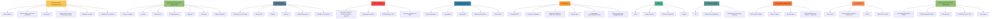

# readmap-dev-java-jr
Este é um repositório com todos os conteúdos necessários para um Desenvolvedor Java JR.

## Fluxograma de estudos

```mermaid
%% Define o layout como Top-to-Bottom (vertical)
graph TB;

    %% Fundamentos de Programação Java
    A[Fundamentos de Programação Java]
    A --> A1[Sintaxe básica]
    A --> A2[Tipos de dados, variáveis e constantes]
    A --> A3[Operadores]
    A --> A4[Estruturas de controle if/else, switch, loops]
    A --> A5[Métodos e funções]
    A --> A6[Tratamento de exceções]

    %% Programação Orientada a Objetos (POO)
    B[Programação Orientada a Objetos POO]
    B --> B1[Classes e Objetos]
    B --> B2[Herança]
    B --> B3[Polimorfismo]
    B --> B4[Encapsulamento]
    B --> B5[Abstração]
    B --> B6[Interfaces]
    B --> B7[Classes abstratas]

    %% Java Avançado
    C[Java Avançado]
    C --> C1[Collections List, Set, Map]
    C --> C2[Streams API]
    C --> C3[Optional]
    C --> C4[Generics]
    C --> C5[Lambda Expressions]
    C --> C6[Threads e Concorrência]

    %% Banco de Dados
    D[Banco de Dados]
    D --> D1[SQL básico SELECT, INSERT, UPDATE, DELETE]
    D --> D2[Modelagem de dados]
    D --> D3[ORM Hibernate, JPA]
    D --> D4[Conexão com banco via JDBC]

    %% Frameworks Backend
    E[Frameworks Backend]
    E --> E1[Spring Framework]
    E --> E2[Spring Boot]
    E --> E3[Spring Data]
    E --> E4[Spring Security básico]
    E --> E5[Spring MVC]

    %% APIs REST
    F[APIs REST]
    F --> F1[Princípios REST]
    F --> F2[Criação de endpoints]
    F --> F3[Métodos HTTP GET, POST, PUT, DELETE]
    F --> F4[Status codes]
    F --> F5[Serialização e desserialização JSON]
    F --> F6[Documentação com Swagger/OpenAPI]

    %% Testes
    G[Testes]
    G --> G1[JUnit]
    G --> G2[Testes unitários]
    G --> G3[Testes de integração]
    G --> G4[Mockito]

    %% Controle de Versão
    H[Controle de Versão]
    H --> H1[Git]
    H --> H2[GitHub, GitLab, Bitbucket]
    H --> H3[Pull Requests, Branching, Merging]

    %% Ferramentas e Ambientes
    I[Ferramentas e Ambientes]
    I --> I1[IDEs IntelliJ, Eclipse]
    I --> I2[Maven, Gradle]
    I --> I3[Docker básico]
    I --> I4[CI/CD GitHub Actions, Jenkins — diferencial]

    %% Boas Práticas
    J[Boas Práticas]
    J --> J1[Clean Code]
    J --> J2[Design Patterns Singleton, Factory, etc.]
    J --> J3[SOLID]
    J --> J4[DRY, KISS, YAGNI]

    %% Conhecimentos Adicionais Diferenciais
    K[Conhecimentos Adicionais Diferenciais]
    K --> K1[Mensageria RabbitMQ, Kafka]
    K --> K2[NoSQL MongoDB, Redis]
    K --> K3[Microserviços]
    K --> K4[Cloud AWS, Azure, GCP]
    K --> K5[Linux básico]

    %% Estilos personalizados
    style A fill:#f9c74f,stroke:#f9844a,stroke-width:2px;
    style B fill:#90be6d,stroke:#43aa8b,stroke-width:2px;
    style C fill:#577590,stroke:#4d908e,stroke-width:2px;
    style D fill:#f94144,stroke:#f3722c,stroke-width:2px;
    style E fill:#277da1,stroke:#577590,stroke-width:2px;
    style F fill:#f8961e,stroke:#f9844a,stroke-width:2px;
    style G fill:#43aa8b,stroke:#90be6d,stroke-width:2px;
    style H fill:#4d908e,stroke:#577590,stroke-width:2px;
    style I fill:#f3722c,stroke:#f94144,stroke-width:2px;
    style J fill:#f9844a,stroke:#f8961e,stroke-width:2px;
    style K fill:#90be6d,stroke:#43aa8b,stroke-width:2px;
```
